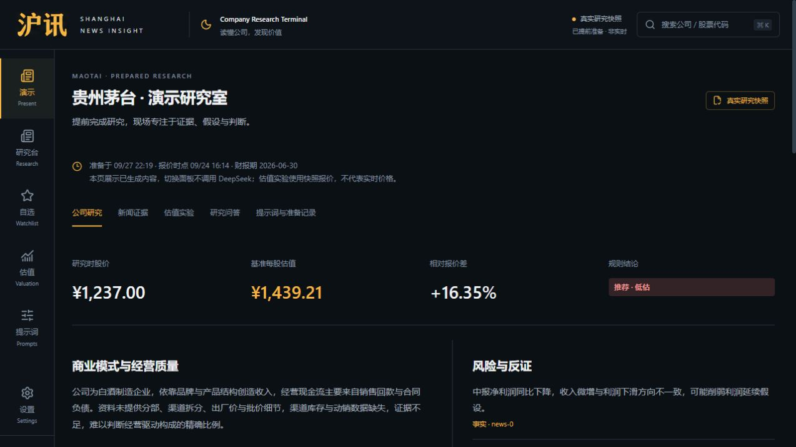
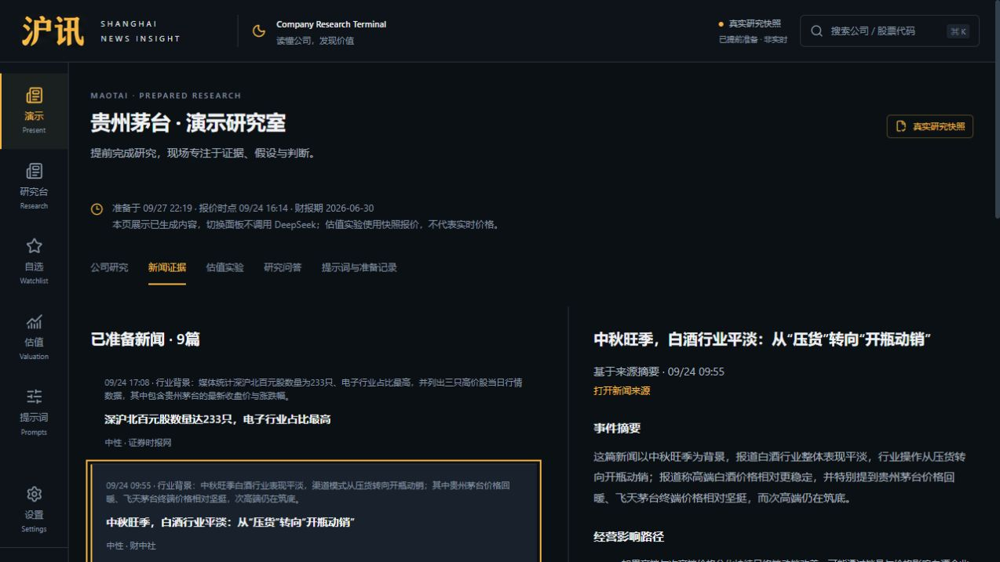
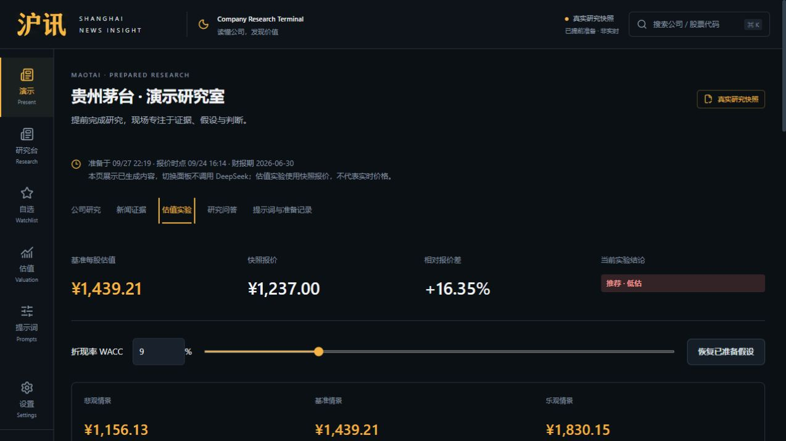
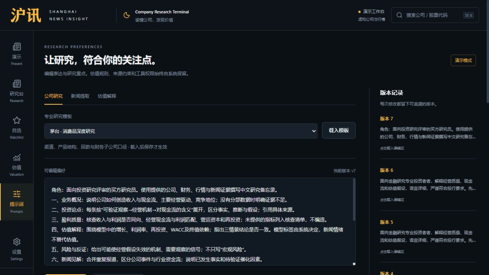
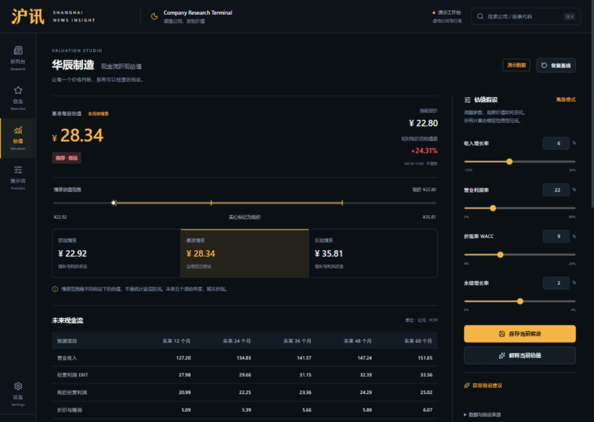
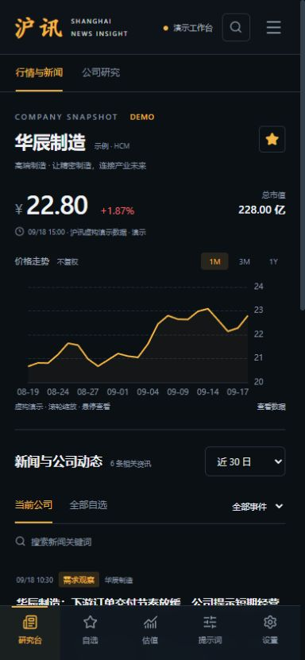
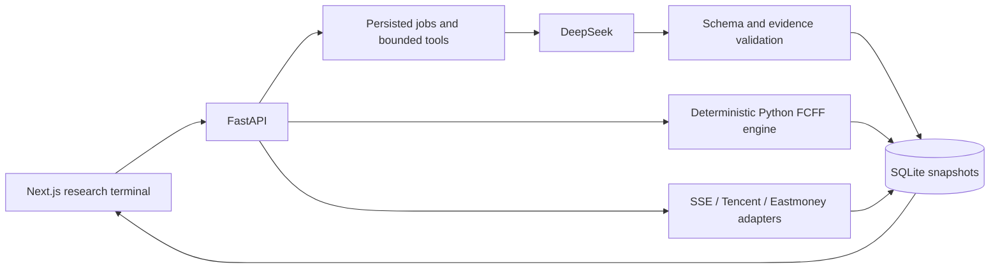

<div align="center">

# 沪讯 · Shanghai News Insight

### From company news to a valuation you can question.

An interactive Shanghai A-share research terminal powered by **DeepSeek**, with evidence-linked analysis and a reproducible **DCF engine**.

**Next.js · TypeScript · FastAPI · Python · SQLite · ECharts**

[中文说明](README.zh-CN.md) · [Quick start](#quick-start) · [Architecture](docs/architecture.md) · [Valuation methodology](docs/valuation-methodology.md)

</div>



*Actual application screenshot. This Maotai case was prepared on September 27, 2026, using a September 24 quote and June 30 financial statements. It is a historical research scenario, not a current price or investment recommendation.*

## Why this project

Equity research spans scattered news, financial statements and valuation assumptions. Shanghai News Insight brings those steps into one workspace: inspect the evidence, challenge the assumptions, then export a traceable research report.

The product pairs a charcoal-and-amber Chinese interface with a clear separation of responsibilities: **Python calculates value; DeepSeek explains the evidence and uncertainty.** Valuation labels are derived from saved model inputs and timestamped prices, rather than invented by the language model.

## A visual product tour

### 01 · Explain what matters in the news

Extract events and sentiment, inspect original evidence, and follow the possible effects on demand, margins, working capital and cash flow. Missing information becomes a research checklist.



### 02 · Make assumptions tangible

Adjust WACC and explore how value changes. The full valuation studio also exposes revenue growth, operating margins and terminal growth, with five-year FCFF, bear/base/bull scenarios and a 5×5 sensitivity grid.



**A concrete demonstration:** in the saved Maotai scenario, changing WACC from 9% to 12% moves estimated value from ¥1,439.21 to ¥990.82 while holding the ¥1,237 quote fixed. This illustrates sensitivity to assumptions; it does not validate either estimate as a target price.

### 03 · Shape the research process

Choose among **nine professional prompt templates** across company research, news extraction and valuation review. Edit a template, save a version and trial it. Coverage includes business quality, channel economics, counterevidence and terminal-value risk.



<details>
<summary><strong>More screens: full valuation studio and mobile layout</strong></summary>





These two screenshots document the September 19 interface and fictional demo data. The four screenshots above were captured on October 2 from the current build; their Maotai data remains the dated September snapshot.

</details>

## What you can do

| Workspace | Capabilities |
| --- | --- |
| Company research | Search Shanghai-listed companies, manage watchlists, inspect price history and generate evidence-linked research |
| News intelligence | Filter news, extract events and sentiment, inspect source spans, analyze up to 20 imported articles per batch |
| Valuation studio | Edit five-year FCFF assumptions, compare scenarios, inspect sensitivity, save versions and review suggested changes |
| Research questions | Ask follow-up questions with tools scoped to the saved report's company and sources |
| Prompt library | Nine templates, editable preferences, saved versions and trial runs |
| Prepared presentation | Browse saved Maotai research, news, explanations and questions without a new model call; recompute DCF locally |
| Export | Download research as Markdown and valuation/news results as CSV |

## How it works



- **Independent calculation:** the valuation engine has no LLM, network or database dependency.
- **Traceable outputs:** source IDs, timestamps, inputs and saved valuation versions accompany research.
- **Bounded model behavior:** structured output validation, citation allowlists, controlled financial placeholders and server-owned source spans.
- **Resilient execution:** persisted job states, progress updates, deadlines, resumable preparation and cached snapshots.
- **Explicit modes:** fictional fixtures and live-source research are kept separate; failed live data is never silently replaced by fictional data.

## Quick start

**Supported setup:** Windows PowerShell, Python 3.11+ and Node.js 22+. The recorded development environment uses Python 3.13 and Node.js 24. Internet access is required to install dependencies.

Download or clone the repository, then open PowerShell in its root folder:

```powershell
.\scripts\setup.ps1
.\scripts\start.ps1
```

Open **http://127.0.0.1:3000**. Interactive API documentation is at **http://127.0.0.1:8010/docs**.

The setup script installs locked dependencies and creates `.env` from `.env.example` if needed. The initial mode uses five fictional companies covering undervalued, overvalued, fair-value, missing-data and unsupported-sector cases. **No API key is needed for this mode**; after installation, it works without external data requests.

To stop the project:

```powershell
.\scripts\stop.ps1
```

For an optimized local preview, stop running services first:

```powershell
npm.cmd --prefix frontend run build
.\scripts\start.ps1 -Production
```

### Enable live DeepSeek research

Set `DEEPSEEK_API_KEY` in the local root `.env`, then restart the backend and switch to real-company research in Settings. The API base URL and model are configurable. Credentials stay on the server.

Live research needs network access, available data providers and a funded provider account. Incomplete financial fields may require sourced manual review before DCF becomes available. The non-financial FCFF model excludes financial institutions.

### Prepare a Maotai presentation

With services running and live financial inputs reviewed:

```powershell
.\.venv\Scripts\python.exe scripts\prepare_presentation.py
```

Then visit **http://127.0.0.1:3000/presentation**. This explicit preparation calls DeepSeek, selects the Maotai prompt templates and saves results locally. Completed steps resume within the same day's preparation. A fresh checkout does **not** contain the author's database or prepared live snapshot; until preparation succeeds, the presentation page shows an empty state. Start with the fictional demo for a key-free walkthrough.

## Reproducibility and validation

```powershell
.\.venv\Scripts\python.exe -m pytest backend/tests -q
npm.cmd --prefix frontend run build
npm.cmd --prefix frontend run typecheck
```

**Packaging check, October 2, 2026:** 54 backend tests passed; frontend type checking passed. The production build was also rechecked for the release package. Tests use an isolated temporary database and an empty model key.

The September 27 live demonstration completed a research report with 13 cited sources, nine article analyses, a nine-article batch, valuation explanations, four proposed assumption changes and three follow-up answers. Some calls needed output repair, and preparation exposed validation failures that were fixed. These are observed integration results, **not model-accuracy or latency guarantees**.

See [release validation](docs/release-validation.md) and the [earlier verification record](docs/verification.md).

## Repository map

```text
backend/       FastAPI routes, adapters, job services, FCFF engine and tests
frontend/      Next.js application, interactive charts and research screens
fixtures/      Reproducible fictional data and CSV import example
scripts/       Setup, start/stop, demo export and explicit live verification
docs/          Architecture, methodology, evidence and screenshot gallery
.env.example   Empty credential template
```

## Scope and limitations

This is a local, single-user FinTech research prototype. Free feeds may be delayed or unavailable, and news commonly consists of excerpts. Historical growth, capital costs, working capital and equity adjustments require judgement; assumptions and manual corrections remain visible. Scenario ranges are not confidence intervals. Market-calendar support currently covers 2026 and requires updates for other years.

No backtesting, automated trading, brokerage integration or claimed return-prediction accuracy is included. Public multi-user deployment would require additional authentication and operational controls. Source data and third-party dependencies retain their respective terms. This repository currently has no project-wide license grant.

---

**Evidence before opinion.** Built to make the path from company information to valuation assumptions visible and testable.
