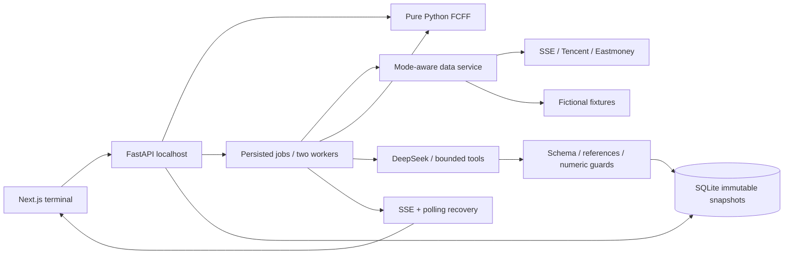

# Architecture

Browser calls only `/api`, proxied to the backend. Keys remain server-side. `valuation/engine.py` has no network, database or LLM dependency. News is fetched in a subprocess with a hard deadline.

`snapshots` stores typed immutable payloads partitioned by mode and symbol. `watchlist` is unique by mode/symbol. `prompts` preserves per-kind versions. `jobs` stores idempotency keys, inputs, status, steps and results. `cache_epochs` invalidates cache lookup without altering historical evidence.

Startup uses Alembic initial migration, accepting matching prototype tables without deletion. Future changes need new migration revisions. Manual financial reviews bind to statement fingerprints; a changed quote does not erase a financial review, but a changed statement invalidates it.

Tasks transition queued→running→complete/failed/cancelled. Restarted running work becomes interrupted; queued work resumes. Two workers and a total timeout bound resource use. SSE and polling use the same persisted job. Clients restore task IDs, ignore old symbol/mode responses and disable duplicate pending submissions.

Research follows a fixed required-data workflow. Follow-up tools are restricted to the current company and its saved sources; no arbitrary URL, shell, files or trading tools. Assumption proposals do not mutate the model until the user applies them.

Source calls can fail independently. Partial reports retain correct calculations, mark missing explanation and preserve sources. Stale or unknown-time prices cannot create current recommendations; demo data never substitutes for live failures.

Services bind to localhost; CORS allows only local frontend origins. Windows scripts use hidden processes and identity checks before stopping project descendants. Dependencies are locked in the frontend package lock and backend requirements lock.
